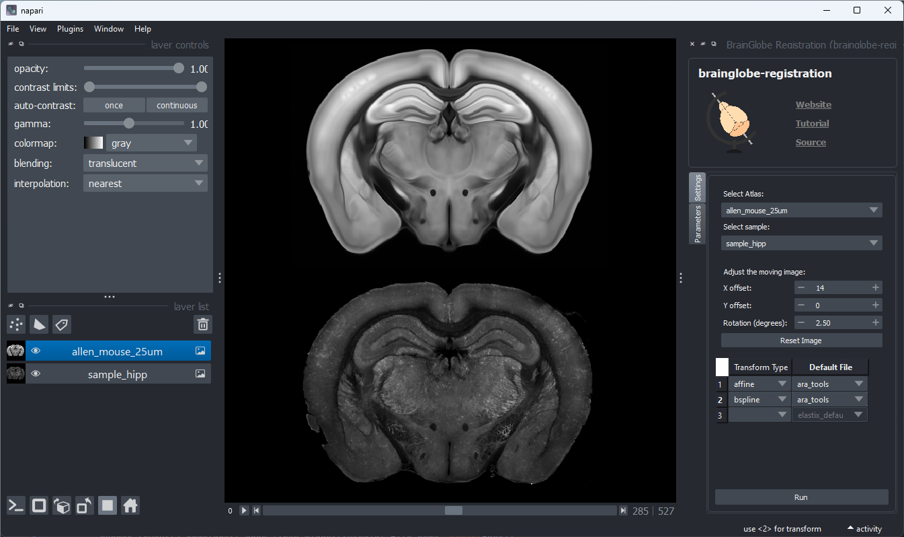
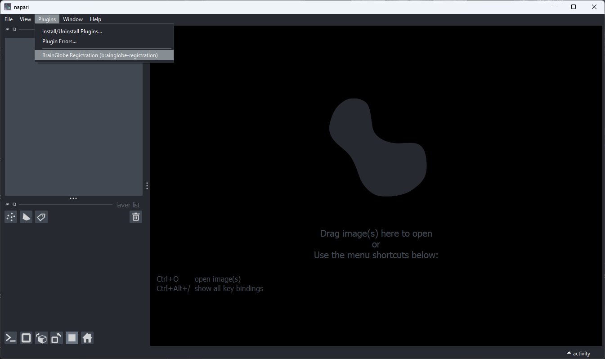
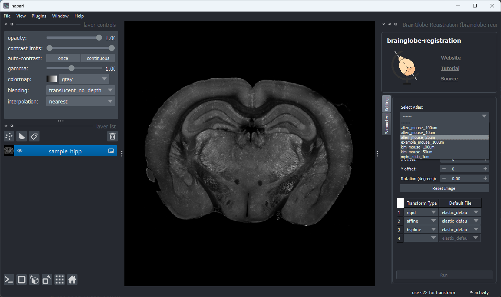
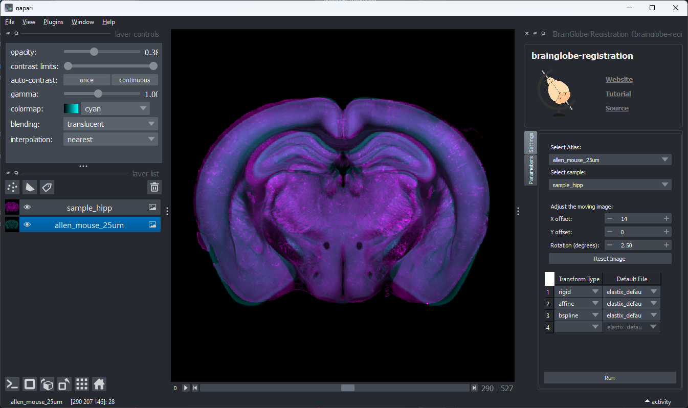
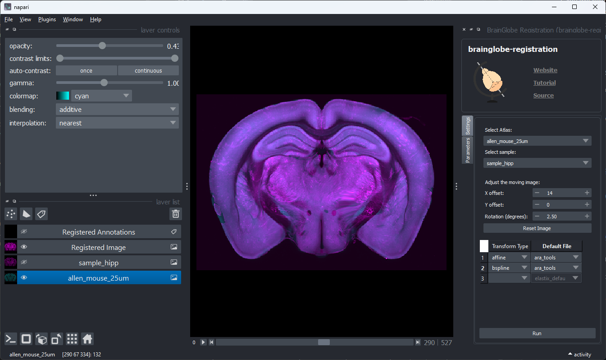
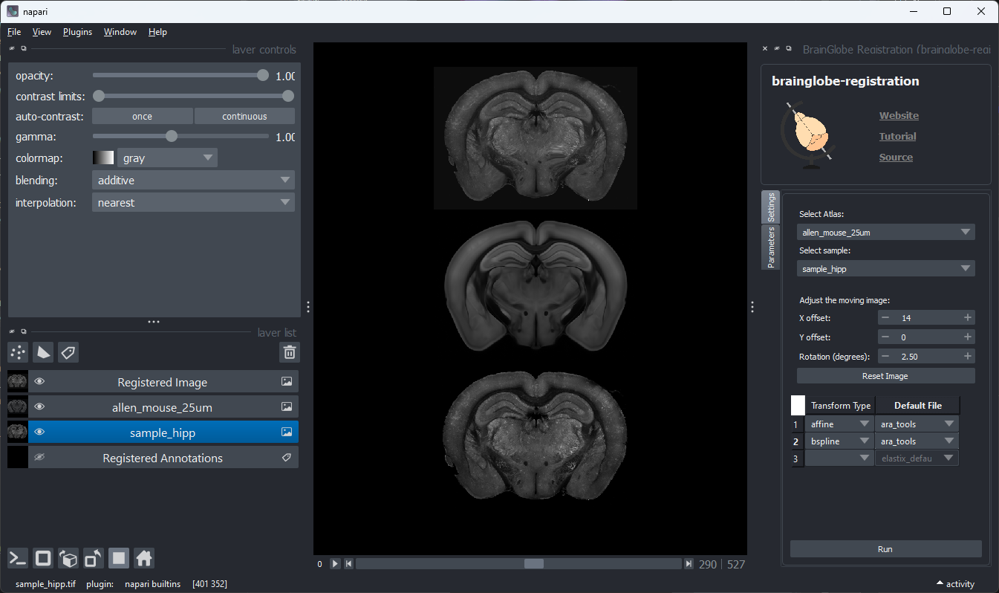

# brainglobe-registration

Registration to a BrainGlobe atlas using Elastix

----------------------------------

A [napari] plugin for registering images to a BrainGlobe atlas.

## Usage

1. Open `napari`.
2. Install the plugin with `pip install git+https://github.com/brainglobe/brainglobe-registration.git`.
3. Open the widget by selecting `Plugins > BrainGlobe Registration` in the napari menu bar near the
top left of the window.

The `BrainGlobe Registration` plugin will appear on the right hand side of the napari window.
4. Open the image you want to register in napari (a sample 2D image can be found by selecting `File > Open Sample > Sample Brain Slice`).
5. Select the atlas you want to register to from the dropdown menu.

The atlas will appear in the napari viewer. Select the approximate `Z` slice of the atlas that you want to register to
using the slider at the bottom of the napari viewer.

6. Adjust the sample image to roughly match the atlas image.
You can do this by adjusting X and Y translation as well as rotation around the centre of the image.
You can overlay the two images by toggling `Grid` mode in the napari viewer (Ctrl+G).
You can then adjust the color map and opacity of the atlas image to make it easier to see the sample image aiding the manual alignment.

The sample image can be reset to its original position and orientation by clicking `Reset Image` in the `BrainGlobe Registration` plugin window.
7. Select the transformations you want to use from the dropdown menu. Set the transformation type to empty to remove a step.
Select from one of the three provided default parameter sets (elastix, ARA, or IBL). Customise the parameters further in the
`Parameters` tab.
8. Click `Run` to register the image. The registered image will appear in the napari viewer.

## Installation

We strongly recommend to use a virtual environment manager (like `conda` or `venv`). The installation instructions below
will not specify the Qt backend for napari, and you will therefore need to install that separately. Please see the
[`napari` installation instructions](https://napari.org/stable/tutorials/fundamentals/installation.html) for further advice on this.

[WIP] You can install `brainglobe-registration` via [pip]:

    pip install brainglobe-registration

To install latest development version :

    pip install git+https://github.com/brainglobe/brainglobe-registration.git

## Contributing

Contributions are very welcome. Tests can be run with [tox], please ensure
the coverage at least stays the same before you submit a pull request.

## License

Distributed under the terms of the [BSD-3] license,
"brainglobe-registration" is free and open source software

## Issues

If you encounter any problems, please [file an issue] along with a detailed description.

## Acknowledgements

This [napari] plugin was generated with [Cookiecutter] using [@napari]'s [cookiecutter-napari-plugin] template.

<!--
Don't miss the full getting started guide to set up your new package:
https://github.com/napari/cookiecutter-napari-plugin#getting-started

and review the napari docs for plugin developers:
https://napari.org/stable/plugins/index.html
-->

[napari]: https://github.com/napari/napari
[Cookiecutter]: https://github.com/audreyr/cookiecutter
[@napari]: https://github.com/napari
[MIT]: http://opensource.org/licenses/MIT
[BSD-3]: http://opensource.org/licenses/BSD-3-Clause
[GNU GPL v3.0]: http://www.gnu.org/licenses/gpl-3.0.txt
[GNU LGPL v3.0]: http://www.gnu.org/licenses/lgpl-3.0.txt
[Apache Software License 2.0]: http://www.apache.org/licenses/LICENSE-2.0
[Mozilla Public License 2.0]: https://www.mozilla.org/media/MPL/2.0/index.txt
[cookiecutter-napari-plugin]: https://github.com/napari/cookiecutter-napari-plugin

[file an issue]: https://github.com/brainglobe/brainglobe-registration/issues

[napari]: https://github.com/napari/napari
[tox]: https://tox.readthedocs.io/en/latest/
[pip]: https://pypi.org/project/pip/
[PyPI]: https://pypi.org/
